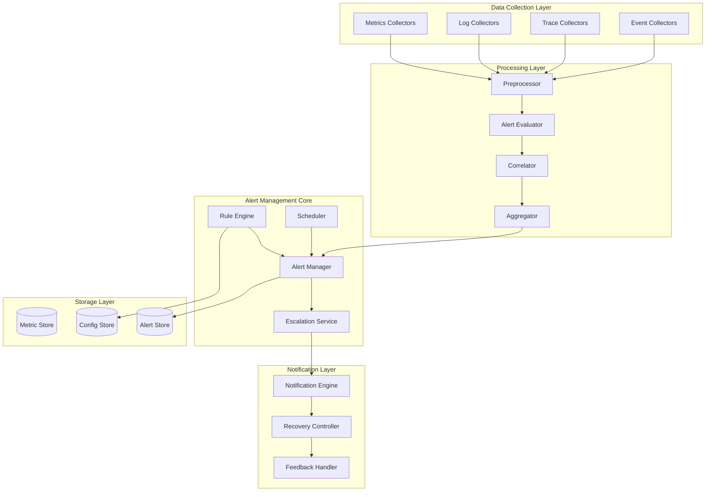
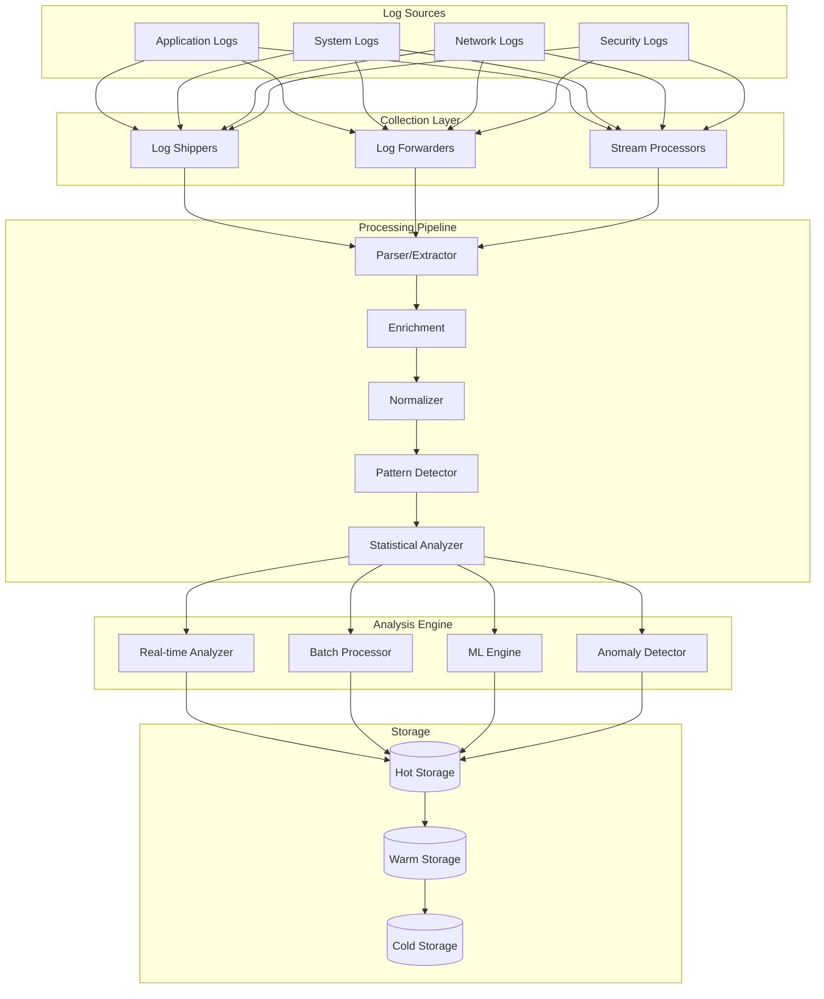
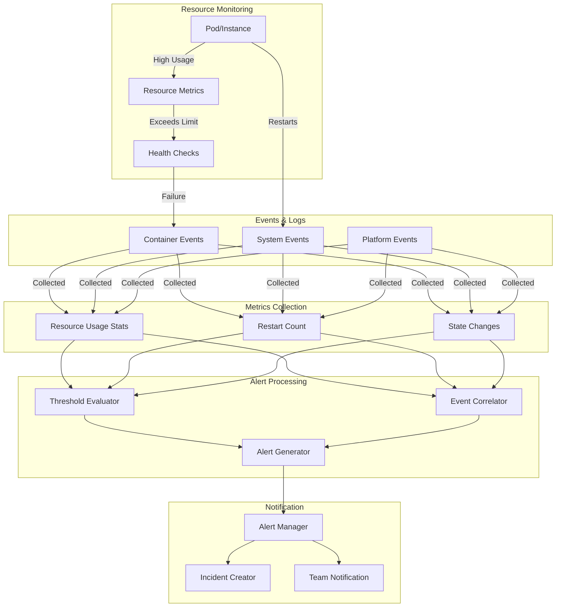

1. Input: days = [1,4,6,7,8,20], costs = [2,7,15]
Output: 11
Explanation: For example, here is one way to buy passes that lets you travel your travel plan:
On day 1, you bought a 1-day pass for costs[0] = $2, which covered day 1.
On day 3, you bought a 7-day pass for costs[1] = $7, which covered days 3, 4, ••, 9.
On day 20, you bought a 1-day pass for costs[0] = $2, which covered day 20.
In total, you spent $11 and covered all the days of your travel.

import java.util.HashSet;
import java.util.Set;

public class MinCostTickets {
    public static int mincostTickets(int[] days, int[] costs) {
        if (days == null || days.length == 0) return 0;
        
        Set<Integer> daySet = new HashSet<>();
        for (int day : days) {
            daySet.add(day);
        }
        
        int lastDay = days[days.length - 1];
        int[] dp = new int[lastDay + 1];
        
        for (int i = 1; i <= lastDay; i++) {
            if (!daySet.contains(i)) {
                dp[i] = dp[i - 1];
            } else {
                // Cost for 1-day pass
                int cost1 = dp[Math.max(0, i - 1)] + costs[0];
                // Cost for 7-day pass
                int cost7 = dp[Math.max(0, i - 7)] + costs[1];
                // Cost for 30-day pass
                int cost30 = dp[Math.max(0, i - 30)] + costs[2];
                
                dp[i] = Math.min(cost1, Math.min(cost7, cost30));
            }
        }
        
        return dp[lastDay];
    }
    
    // Example Usage
    public static void main(String[] args) {
        int[] days = {1, 4, 6, 7, 8, 20};
        int[] costs = {2, 7, 15};
        System.out.println(mincostTickets(days, costs)); // Output: 11
    }
}

## done above question in 30mins itself.

I'm done with it in 30mins,
Now he asked on High level how wud you design the log monitoring tools like Grafana
### HLD Question
an ALert system based on setup conditions requirements;
1. logs will be there for monitoring
2. once in the logs any configured alert condition is met then how the alert we tragered
3. How do you fetch the data from logs(timeseries DB) to the alert issue.
4. which pod, which instance, which application that caused the alert.


How the alerts are triggered
    => I said using webhooks
    => apart from webhooks what other ways are present?
What diff log levels are there and how do you store them
    => mentioned like 

asked did you use gRPC anytime
    => i said no

asked did you use Kafka anytime
    => I said I've used it for PRODUCER case
    => we push the msg events into queue where the end CONSUMER grps will process the events
    => utilized grafana tools to monitor the lag piledup
    => setup alerts for the same
He was expecting the flows of data
    => in the available time I couldn't mention that.

He asked like when a pod/instance gets restarted after some highusage,
How does it get reported and tracked so that alert will be sent respective to that.
    => I couldn't provide proper answer to it.


### I think claude provided nice answer for it,

Let me break down the key components of an Alert Management System with a theoretical perspective:




Let's examine each major component in detail:

1. Data Collection Layer
   - Metric Collectors
     * Time-series data gatherers
     * Resource utilization monitors
     * Performance metric collectors
     * Custom metric collectors
   - Log Collectors
     * Application logs
     * System logs
     * Security logs
     * Audit logs
   - Trace Collectors
     * Distributed tracing
     * Request tracking
     * Service dependencies
   - Event Collectors
     * State changes
     * System events
     * Application events

2. Processing Layer
   - Preprocessor
     * Data normalization
     * Data validation
     * Data enrichment
     * Filtering
   - Alert Evaluator
     * Threshold checking
     * Anomaly detection
     * Pattern recognition
     * Statistical analysis
   - Correlator
     * Event correlation
     * Root cause analysis
     * Dependency mapping
   - Aggregator
     * Data summarization
     * Time-window analysis
     * Cross-metric analysis

3. Alert Management Core
   - Rule Engine
     * Alert definitions
     * Threshold configurations
     * Complex event processing
     * Dynamic rule updates
   - Alert Manager
     * Alert state management
     * Deduplication
     * Alert grouping
     * Priority assignment
   - Escalation Service
     * Escalation policies
     * On-call schedules
     * Rotation management
     * Fallback handlers
   - Scheduler
     * Time-based alerts
     * Maintenance windows
     * Alert suppression periods
     * Recurring checks

4. Notification Layer
   - Notification Engine
     * Multi-channel support
     * Template management
     * Delivery tracking
     * Retry mechanisms
   - Recovery Controller
     * Auto-remediation
     * Playbook execution
     * Recovery verification
   - Feedback Handler
     * Alert feedback
     * False positive tracking
     * Alert effectiveness metrics

5. Storage Layer
   - Metric Store
     * Time-series databases
     * Historical data
     * Performance metrics
   - Alert Store
     * Alert history
     * State changes
     * Resolution data
   - Config Store
     * System configurations
     * Alert definitions
     * User preferences

6. Integration Components
   - External Systems
     * Monitoring tools
     * Incident management
     * ChatOps integration
     * Ticketing systems
   - APIs
     * REST APIs
     * Webhook support
     * Custom integrations
     * SDK support

7. Security Components
   - Authentication
     * User management
     * Role-based access
     * API keys
   - Audit
     * Action logging
     * Change tracking
     * Compliance reporting

8. Management Components
   - Administration
     * System configuration
     * User management
     * Team management
   - Reporting
     * Alert analytics
     * Performance reports
     * SLA tracking

Key Features Across Components:

1. Flexibility
   - Custom alert definitions
   - Pluggable architecture
   - Extensible integrations
   - Configurable workflows

2. Scalability
   - Distributed processing
   - Load balancing
   - High availability
   - Horizontal scaling

3. Reliability
   - Fault tolerance
   - Data redundancy
   - Error handling
   - Recovery mechanisms

4. Performance
   - Real-time processing
   - Low latency
   - Efficient storage
   - Quick retrieval

5. Maintainability
   - Modular design
   - Clear separation of concerns
   - Version control
   - Documentation

Best Practices:

1. Alert Design
   - Actionable alerts
   - Clear ownership
   - Proper prioritization
   - Meaningful thresholds

2. Noise Reduction
   - Alert correlation
   - Deduplication
   - Smart grouping
   - Suppression rules

3. Operational Efficiency
   - Automated responses
   - Self-service capabilities
   - Knowledge base integration
   - Continuous improvement

This theoretical framework provides a comprehensive view of an Alert Management System's components, which can be implemented using various tools like CloudWatch, Grafana, or custom solutions while maintaining the same fundamental architecture and principles.


Let me explain the log analysis pipeline in an Alert Management System:



Let's break down each component and its role in log analysis:

1. Log Collection & Ingestion
   ```
   A. Log Sources
   - Applications (structured/unstructured)
   - System metrics
   - Network devices
   - Security systems
   - Custom sources

   B. Collection Methods
   - Log shippers (Filebeat, Fluentd)
   - Direct API ingestion
   - Syslog receivers
   - Custom collectors
   ```

2. Initial Processing Pipeline
   ```
   A. Parsing & Extraction
   - Timestamp normalization
   - Field extraction
   - JSON parsing
   - Regex matching
   - Structure validation

   B. Enrichment
   - Metadata addition
   - Geolocation data
   - User context
   - Environment info
   - Business context

   C. Normalization
   - Format standardization
   - Field naming conventions
   - Value normalization
   - Character encoding
   - Time zone handling
   ```

3. Analysis Methods

```java
class LogAnalyzer {
    
    // Pattern-based Analysis
    private void analyzePatterns(LogEntry log) {
        // Regex patterns for known issues
        Map<String, Pattern> knownPatterns = new HashMap<>();
        knownPatterns.put("memory_leak", Pattern.compile("OutOfMemoryError.*"));
        knownPatterns.put("disk_full", Pattern.compile("No space left on device.*"));
        
        // Check against patterns
        for (Map.Entry<String, Pattern> pattern : knownPatterns.entrySet()) {
            if (pattern.getValue().matcher(log.getMessage()).matches()) {
                raiseAlert(pattern.getKey(), log);
            }
        }
    }
    
    // Statistical Analysis
    private void analyzeStatistics(List<LogEntry> logs, TimeWindow window) {
        // Calculate baseline metrics
        double avgErrorRate = calculateAvgErrorRate(logs, window);
        double stdDeviation = calculateStdDeviation(logs, window);
        
        // Check for anomalies
        if (currentErrorRate > avgErrorRate + (2 * stdDeviation)) {
            raiseAlert("high_error_rate", currentErrorRate);
        }
    }
    
    // Machine Learning Based Analysis
    private void mlBasedAnalysis(LogEntry log) {
        // Feature extraction
        Map<String, Double> features = extractFeatures(log);
        
        // Anomaly detection
        if (anomalyDetector.predict(features) == ANOMALY) {
            raiseAlert("ml_anomaly_detected", log);
        }
    }
}
```

4. Real-time Processing Components
   ```
   A. Stream Processing
   - Window functions
   - Sliding windows
   - Tumbling windows
   - Session windows
   
   B. Pattern Matching
   - Sequence detection
   - Threshold violations
   - Frequency analysis
   - Correlation rules
   ```

5. Storage Strategy
   ```
   A. Hot Storage (Recent data)
   - In-memory databases
   - Quick access
   - Real-time querying
   - High write throughput

   B. Warm Storage (Recent history)
   - SSD-based storage
   - Indexed for quick retrieval
   - Compressed format
   - Medium access speed

   C. Cold Storage (Historical data)
   - Object storage
   - Highly compressed
   - Batch processing
   - Cost-optimized
   ```

6. Alert Generation Logic:
```python
def generate_alerts(log_entry):
    # 1. Threshold-based alerts
    if exceeds_threshold(log_entry):
        create_alert('threshold_violation', severity='high')
    
    # 2. Pattern-based alerts
    if matches_error_pattern(log_entry):
        create_alert('error_pattern_detected', severity='medium')
    
    # 3. Anomaly-based alerts
    if is_anomaly(log_entry):
        create_alert('anomaly_detected', severity='high')
    
    # 4. Frequency-based alerts
    if high_occurrence(log_entry):
        create_alert('high_frequency', severity='medium')
```

7. Performance Optimization Techniques
   ```
   A. Processing Optimization
   - Parallel processing
   - Batch processing
   - Caching strategies
   - Index optimization

   B. Storage Optimization
   - Data compression
   - Partitioning
   - Retention policies
   - Archival strategies
   ```

8. Advanced Analysis Features:

```java
class AdvancedAnalysis {
    // Correlation Analysis
    private void correlateEvents(List<LogEntry> logs) {
        // Group related events
        Map<String, List<LogEntry>> correlatedEvents = logs.stream()
            .collect(Collectors.groupingBy(LogEntry::getCorrelationId));
            
        // Analyze event chains
        for (List<LogEntry> chain : correlatedEvents.values()) {
            if (isErrorChain(chain)) {
                raiseAlert("error_chain_detected", chain);
            }
        }
    }
    
    // Root Cause Analysis
    private void findRootCause(Alert alert) {
        // Backtrack through related events
        List<LogEntry> relatedLogs = getRelatedLogs(alert);
        Graph<LogEntry> eventGraph = buildEventGraph(relatedLogs);
        
        // Find root cause using graph analysis
        LogEntry rootCause = findRootNode(eventGraph);
        enrichAlert(alert, rootCause);
    }
}
```

This complex system ensures:
1. Efficient processing of large log volumes
2. Quick detection of issues
3. Accurate alert generation
4. Minimal false positives
5. Scalable architecture
6. Historical analysis capabilities

The key to successful log analysis is balancing:
- Processing speed vs accuracy
- Storage cost vs accessibility
- Alert sensitivity vs noise
- Real-time vs batch processing
- Resource utilization vs functionality


Let me explain the flow of how pod/instance restart monitoring and alerting works:



Let's break down the complete flow:

1. Resource Monitoring Metrics
```yaml
pod_metrics:
  cpu:
    usage_percent: float
    throttling_events: int
    request_limit_ratio: float
  memory:
    usage_bytes: int
    max_usage_bytes: int
    page_faults: int
    oom_events: int
  disk:
    io_usage: float
    iops: int
  restart:
    count: int
    last_restart_timestamp: timestamp
    restart_reason: string
```

2. Event Detection System:
```python
class PodHealthMonitor:
    def monitor_pod_health(self, pod_name):
        metrics = collect_pod_metrics(pod_name)
        
        # Check for high resource usage
        if self.is_resource_critical(metrics):
            record_pre_restart_state(pod_name, metrics)
            
        # Monitor for restart events
        if self.detect_restart_event(pod_name):
            post_restart_analysis(pod_name)

    def is_resource_critical(self, metrics):
        return (
            metrics.cpu.usage_percent > CPU_THRESHOLD or
            metrics.memory.usage_bytes > MEMORY_THRESHOLD or
            metrics.memory.oom_events > 0
        )

    def detect_restart_event(self, pod_name):
        current_state = get_pod_state(pod_name)
        previous_state = get_previous_state(pod_name)
        return current_state.restart_count > previous_state.restart_count
```

3. Restart Detection & Analysis:
```java
class RestartAnalyzer {
    
    public RestartEvent analyzeRestart(String podId) {
        // Collect pre-restart metrics
        Map<String, Metric> preRestartMetrics = getPreRestartMetrics(podId);
        
        // Collect restart details
        RestartDetails details = new RestartDetails(
            podId,
            getRestartTimestamp(),
            getRestartReason(),
            getResourceUsageBeforeRestart(),
            getSystemEventsBeforeRestart()
        );
        
        // Analyze restart cause
        RestartCause cause = determineRestartCause(details);
        
        return new RestartEvent(details, cause, preRestartMetrics);
    }
    
    private RestartCause determineRestartCause(RestartDetails details) {
        if (details.hasOOMKill()) {
            return RestartCause.OOM_KILLED;
        } else if (details.hasCPUThrottling()) {
            return RestartCause.CPU_THROTTLED;
        } else if (details.hasLivenessProbeFailure()) {
            return RestartCause.LIVENESS_PROBE_FAILED;
        }
        return RestartCause.UNKNOWN;
    }
}
```

4. Alert Generation Logic:
```python
class RestartAlertGenerator:
    def generate_restart_alert(self, restart_event):
        alert = Alert(
            name="pod_restart_detected",
            severity=self.determine_severity(restart_event),
            labels={
                "pod": restart_event.pod_id,
                "namespace": restart_event.namespace,
                "cause": restart_event.cause,
                "cluster": restart_event.cluster
            },
            annotations={
                "summary": f"Pod {restart_event.pod_id} restarted due to {restart_event.cause}",
                "description": self.generate_description(restart_event),
                "pre_restart_metrics": restart_event.pre_restart_metrics,
                "recovery_status": restart_event.recovery_status
            }
        )
        return alert

    def determine_severity(self, restart_event):
        if restart_event.is_critical_service():
            return "critical"
        if restart_event.repeated_restarts():
            return "high"
        return "warning"
```

5. Monitoring Configuration (Prometheus example):
```yaml
rules:
  - alert: PodHighRestartRate
    expr: |
      increase(kube_pod_container_status_restarts_total[1h]) > 3
    for: 5m
    labels:
      severity: warning
    annotations:
      summary: "Pod {{ $labels.pod }} has high restart rate"
      
  - alert: PodOOMKilled
    expr: |
      kube_pod_container_status_last_terminated_reason{reason="OOMKilled"} == 1
    for: 0m
    labels:
      severity: critical
      
  - alert: PodResourceExhaustion
    expr: |
      container_memory_usage_bytes / container_spec_memory_limit_bytes > 0.95
    for: 5m
    labels:
      severity: warning
```

6. Recovery Tracking:
```java
class RecoveryTracker {
    public void trackRecovery(String podId) {
        // Track post-restart metrics
        Map<String, Double> postRestartMetrics = collectPostRestartMetrics(podId);
        
        // Compare with pre-restart state
        boolean isStable = compareWithPreRestartState(podId, postRestartMetrics);
        
        // Track recovery time
        long recoveryTime = calculateRecoveryTime(podId);
        
        // Update recovery status
        updateRecoveryStatus(podId, isStable, recoveryTime);
    }
    
    private boolean isRecoverySuccessful(Map<String, Double> metrics) {
        return metrics.get("cpu_usage") < CPU_THRESHOLD &&
               metrics.get("memory_usage") < MEMORY_THRESHOLD &&
               metrics.get("error_rate") < ERROR_THRESHOLD;
    }
}
```

7. Alert Correlation:
```python
def correlate_restart_events(pod_id, time_window):
    # Gather related events
    related_events = {
        'restarts': get_restart_events(pod_id, time_window),
        'resource_alerts': get_resource_alerts(pod_id, time_window),
        'platform_events': get_platform_events(pod_id, time_window),
        'deployment_events': get_deployment_events(pod_id, time_window)
    }
    
    # Analyze patterns
    pattern = analyze_event_pattern(related_events)
    
    # Generate correlated alert if needed
    if pattern.requires_escalation():
        generate_correlated_alert(pattern)
```

Key Features of this System:

1. Pre-restart State Capture
   - Resource usage trends
   - Error logs
   - System events
   - Performance metrics

2. Post-restart Analysis
   - Recovery verification
   - Stability checks
   - Performance comparison
   - Service impact assessment

3. Alert Enrichment
   - Restart cause
   - Historical context
   - Impact assessment
   - Recovery recommendations

4. Tracking Mechanisms
   - Restart frequency
   - Resource trends
   - Recovery patterns
   - Service degradation

This comprehensive monitoring and alerting system ensures:
1. Quick detection of restarts
2. Accurate root cause analysis
3. Proper alert prioritization
4. Effective recovery tracking
5. Historical pattern analysis