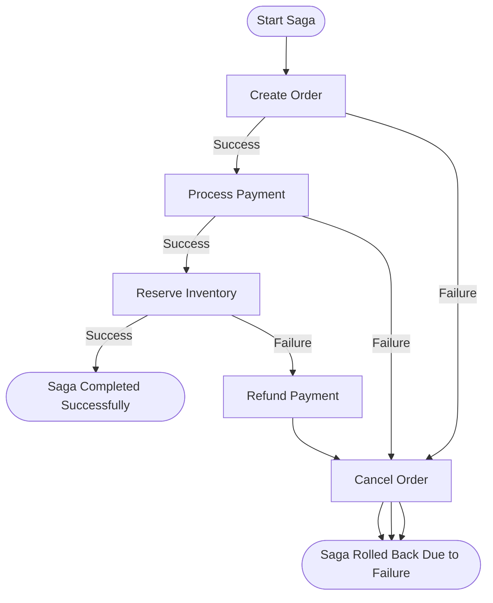

# ** Architectural round **
## **1. Asked how I've improved ** ==> Optimized payments SDK for Adyen integration, reducing development time by 25% for new payment methods. Leveraging TypeScript Shadow DOM for encapsulation.
## **2. asked on **==> Migrated and refactored APIs, boosting code efficiency by 25%.
## **3. design a state machine**
'''
The state machine should be able to handle a finite set of states and transitions between them, as well as actions associated with each transition.
Your implementation should include:
• A set of states and transitions that represent the states of the state machine
• Actions that should be executed when a transition occurs
• A mechanism to trigger transitions between states
• Unit tests to verify the correct behaviour of the state machine
You can assume that the state machine has a single initial state and can transition between states in response to external events. The actions associated with each transition should be simple print statements to the console indicating the current state of the state machine.
State 1 - fraud check - state2 - preauth - booking confirmation -> email → fin

'''
```mermaid
sequenceDiagram
    participant C as Client
    participant O as Orchestrator
    participant DB as State Store (DB)
    participant Q as Message Queue
    participant S1 as Service 1
    participant S2 as Service 2
    participant S3 as Service 3
    
    Note over O,DB: Saga Instance Created
    
    C->>O: Start Saga Transaction
    O->>DB: Create Saga Entry
    DB-->>O: Saga ID
    
    rect rgb(200, 255, 200)
        Note over O,S3: Normal Flow
        O->>Q: Publish Command (Service 1)
        Q->>S1: Process Command
        S1-->>Q: Success Response
        Q-->>O: Success Response
        O->>DB: Update Step 1 Status
        
        O->>Q: Publish Command (Service 2)
        Q->>S2: Process Command
        S2-->>Q: Success Response
        Q-->>O: Success Response
        O->>DB: Update Step 2 Status
        
        O->>Q: Publish Command (Service 3)
        Q->>S3: Process Command
        S3-->>Q: Failure Response
        Q-->>O: Failure Response
    end
    
    rect rgb(255, 200, 200)
        Note over O,S1: Compensation Flow
        O->>DB: Mark Saga Failed
        O->>Q: Compensation Command (Service 2)
        Q->>S2: Rollback Changes
        S2-->>Q: Compensation Complete
        Q-->>O: Compensation Confirmed
        
        O->>Q: Compensation Command (Service 1)
        Q->>S1: Rollback Changes
        S1-->>Q: Compensation Complete
        Q-->>O: Compensation Confirmed
        
        O->>DB: Mark Saga Compensated
    end
    
    O-->>C: Saga Complete (Rolled Back)
    
    Note over DB: Database Schema
    
    classDiagram
        class saga_instances {
            +String saga_id
            +String saga_type
            +Int current_step
            +String status
            +JSON payload
            +Timestamp created_at
            +Timestamp updated_at
        }
        
        class saga_steps {
            +String step_id
            +String saga_id
            +String step_name
            +String status
            +JSON response_data
            +Int retry_count
        }
        
        saga_instances "1" -- "many" saga_steps
        
    Note over Q: Queue Structure
    
    classDiagram
        class command_queue {
            +String message_id
            +String saga_id
            +String service_id
            +JSON command_data
            +Timestamp timestamp
        }
        
        class response_queue {
            +String message_id
            +String saga_id
            +String service_id
            +JSON response_data
            +Boolean success
            +Timestamp timestamp
        }

```

Let me explain the key aspects of this diagram:

1. Communication Patterns:
   - Orchestrator → Services: Async via Message Queue
   - Services → Orchestrator: Async via Response Queue
   - Orchestrator → Database: Sync
   - Client → Orchestrator: Sync/Async (configurable)

2. Database Interactions:
   - saga_instances: Tracks overall saga state
   - saga_steps: Tracks individual step states
   - Maintains full audit trail and recovery information

3. Rollback Flow:
   - Triggered on any service failure
   - Executes compensating transactions in reverse order
   - Uses same queue infrastructure as forward flow
   - Maintains compensation state in database

4. Queue Structure:
   - command_queue: For initiating service actions
   - response_queue: For receiving service responses
   - Ensures reliable message delivery and processing

5. Key Features Shown:
   - Full lifecycle of saga transaction
   - Compensation flow triggered by failure
   - State management in database
   - Asynchronous service communication
   - Queue-based message routing

Would you like me to explain any specific part of the flow in more detail?

The **Saga pattern** is a robust architectural pattern used to manage complex, long-running transactions in distributed systems, particularly within microservices architectures. It ensures data consistency across multiple services without relying on traditional distributed transactions, which can be cumbersome and less scalable. The Saga pattern achieves this by breaking down a large transaction into a series of smaller, manageable local transactions, each of which updates a single service and publishes events or sends messages to trigger the next step in the saga.

There are two primary implementations of the Saga pattern:

1. **Orchestration-Based Sagas**
2. **Choreography-Based Sagas**

Your question specifically pertains to **orchestration-based sagas**, so let's delve into how they internally implement state management, handle failures, perform rollbacks, and manage communication (synchronous vs. asynchronous).

### 1. Orchestration-Based Saga Pattern Overview

In the **orchestration-based saga**, a central orchestrator (often a dedicated service) is responsible for coordinating the sequence of local transactions across various microservices. The orchestrator directs the saga's workflow, manages its state, and ensures that each step is executed in the correct order. This centralization provides clear visibility and control over the saga's progression.

### 2. Internal Implementation and State Management

**a. Orchestrator Role:**
- **Central Control:** The orchestrator serves as the central point of control for the saga. It dictates the order in which transactions are executed and monitors their outcomes.
- **State Management:** It maintains the current state of the saga, tracking which transactions have been completed, which are pending, and any compensating actions that may be necessary.

**b. Communication with Services:**
- **Commands and Events:** The orchestrator sends commands to services to initiate local transactions and listens for events or responses indicating the success or failure of those transactions.
- **Asynchronous Messaging:** Typically, communication between the orchestrator and the services is handled asynchronously using message brokers (e.g., RabbitMQ, Kafka) to ensure loose coupling and resilience.

**c. Persistence:**
- **Durable State Storage:** The orchestrator persists the saga's state in a durable storage system (like a database) to recover from failures without losing progress. This ensures that the saga can resume correctly after interruptions.

### 3. Handling Failures and Rollbacks

Failures are inevitable in distributed systems, and the Saga pattern provides a mechanism to handle them gracefully through **compensating transactions**.

**a. Failure Detection:**
- **Monitoring Responses:** The orchestrator monitors the responses from each service. If a service reports a failure or doesn't respond within a specified timeout, the orchestrator detects this as a failure in the saga.

**b. Compensating Actions:**
- **Inverse Operations:** For each successful transaction that precedes the failure, the orchestrator invokes a compensating transaction to undo the effects of that transaction. These compensations are specific to each service and are designed to revert the system to its previous consistent state.
  
  *Example:*
  - **Initial Transaction:** Reserving inventory in a warehouse service.
  - **Failure:** Payment processing fails.
  - **Compensation:** Releasing the reserved inventory.

**c. Sequence of Rollbacks:**
- **Reverse Order:** Compensating transactions are typically executed in the reverse order of the original transactions to maintain consistency and handle dependencies properly.

### 4. Synchronous vs. Asynchronous Execution

**a. Asynchronous Communication:**
- **Primary Mode:** Orchestration-based sagas predominantly use asynchronous communication. This approach enhances scalability and resilience by decoupling services and allowing them to operate independently.
- **Message Brokers:** Asynchronous messaging via brokers like Kafka or RabbitMQ facilitates non-blocking interactions between the orchestrator and services.

**b. Synchronous Aspects:**
- **Orchestrator Waits for Responses:** While the overall communication is asynchronous, the orchestrator may wait for confirmations or acknowledgments from services before proceeding to the next step. However, this waiting is typically managed in a non-blocking manner to maintain system responsiveness.

**c. Benefits of Asynchronous Execution:**
- **Resilience:** Systems remain responsive even if some services are slow or temporarily unavailable.
- **Scalability:** Services can handle messages at their own pace without being tightly coupled to the orchestrator's processing speed.
- **Fault Tolerance:** Asynchronous systems can better handle partial failures and recover gracefully.

### 5. Example Workflow of an Orchestration-Based Saga

Let's consider a simplified example of an e-commerce order processing saga involving three services: **Order Service**, **Payment Service**, and **Inventory Service**.

1. **Order Creation:**
   - **Orchestrator:** Sends a command to the Order Service to create a new order.
   - **Order Service:** Creates the order and emits an event indicating success.

2. **Payment Processing:**
   - **Orchestrator:** Upon receiving the order creation success, sends a command to the Payment Service to process the payment.
   - **Payment Service:** Attempts to process the payment. If successful, emits a success event; otherwise, emits a failure event.

3. **Inventory Reservation:**
   - **Orchestrator:** Upon successful payment, sends a command to the Inventory Service to reserve items.
   - **Inventory Service:** Reserves the inventory and emits a success event. If reservation fails, emits a failure event.

4. **Failure Handling and Compensation:**
   - **If Payment Fails:**
     - **Orchestrator:** Sends a compensating command to the Order Service to cancel the order.
   - **If Inventory Reservation Fails:**
     - **Orchestrator:** Sends compensating commands to both the Payment Service to refund the payment and the Order Service to cancel the order.

### 6. Advantages of Orchestration-Based Sagas

- **Centralized Control:** Easier to manage and monitor the saga's progress.
- **Clear Error Handling:** The orchestrator has a clear understanding of where failures occur and what compensations are needed.
- **Simplified Service Logic:** Services don't need to be aware of the entire saga; they only handle their local transactions and compensations.

### 7. Considerations and Best Practices

- **Idempotency:** Ensure that both forward and compensating transactions are idempotent to handle retries without adverse effects.
- **Timeouts and Retries:** Implement appropriate timeout and retry mechanisms to handle transient failures and ensure saga completion.
- **Monitoring and Logging:** Maintain comprehensive monitoring and logging to track the saga's progress and troubleshoot issues effectively.
- **Design Compensations Carefully:** Compensating transactions should accurately and reliably undo the effects of their corresponding forward transactions.

### Conclusion

The **orchestration-based saga pattern** effectively manages distributed transactions by centralizing control within an orchestrator, which coordinates the execution of local transactions across multiple services. In the event of a failure, the orchestrator initiates compensating transactions to rollback the system to a consistent state. Communication between the orchestrator and services is primarily **asynchronous**, leveraging message-driven architectures to enhance scalability, resilience, and decoupling.

This pattern is particularly beneficial in complex microservices environments where maintaining data consistency without tightly coupling services is paramount. By carefully designing orchestrators and compensating actions, systems can achieve robust transaction management that gracefully handles failures and maintains overall system integrity.


Certainly! Let's delve deeper into the **Orchestration-Based Saga Pattern**, focusing on:

1. **How the orchestrator configures and manages the sequence of service calls during normal execution and rollback (compensation).**
2. **Where and how the orchestrator maintains the saga's state information.**

### **1. Configuring Service Call Sequences and Handling Rollbacks**

#### **a. Defining the Saga Workflow**

The orchestrator needs a clear definition of the workflow it manages. This includes:

- **Sequence of Steps:** The order in which services should be invoked.
- **Compensating Actions:** The inverse operations to rollback changes if a step fails.
- **Conditional Logic:** Branching based on success or failure of each step.

**Approaches to Define Workflows:**

1. **Code-Based Configuration:**
   - Implemented using workflow engines or libraries within the orchestrator's codebase.
   - **Example:** Using a state machine library to define states and transitions.

2. **Declarative Configuration:**
   - Defining workflows using configuration files (e.g., YAML, JSON) or domain-specific languages (DSLs).
   - **Example:** Using workflow definition files that specify the sequence and compensations.

3. **Graphical Workflow Designers:**
   - Visual tools to design and manage workflows, which the orchestrator can interpret.
   - **Example:** Tools like Camunda Modeler or AWS Step Functions’ graphical interface.

**Example: Code-Based Workflow Definition**

Below is a simplified example using pseudocode to define a saga workflow:

```python
class SagaOrchestrator:
    def __init__(self, data_store):
        self.data_store = data_store

    def execute_saga(self, saga_id, saga_data):
        try:
            # Step 1: Create Order
            self.data_store.update_state(saga_id, state="Creating Order")
            create_order_result = self.create_order(saga_data)
            if not create_order_result.success:
                raise Exception("Create Order Failed")

            # Step 2: Process Payment
            self.data_store.update_state(saga_id, state="Processing Payment")
            payment_result = self.process_payment(saga_data)
            if not payment_result.success:
                raise Exception("Process Payment Failed")

            # Step 3: Reserve Inventory
            self.data_store.update_state(saga_id, state="Reserving Inventory")
            inventory_result = self.reserve_inventory(saga_data)
            if not inventory_result.success:
                raise Exception("Reserve Inventory Failed")

            # Saga Completed Successfully
            self.data_store.update_state(saga_id, state="Completed")
        
        except Exception as e:
            self.handle_compensation(saga_id, saga_data, failed_step=e)

    def handle_compensation(self, saga_id, saga_data, failed_step):
        current_state = self.data_store.get_state(saga_id)
        if current_state == "Processing Payment":
            self.refund_payment(saga_data)
            self.cancel_order(saga_data)
        elif current_state == "Reserving Inventory":
            self.release_inventory(saga_data)
            self.refund_payment(saga_data)
            self.cancel_order(saga_data)
        # Update saga state as failed
        self.data_store.update_state(saga_id, state="Rolled Back")

    # Placeholder methods for service interactions
    def create_order(self, data): pass
    def process_payment(self, data): pass
    def reserve_inventory(self, data): pass
    def refund_payment(self, data): pass
    def cancel_order(self, data): pass
    def release_inventory(self, data): pass
```

**Explanation:**

- **Saga Execution:**
  - The orchestrator sequentially executes each step.
  - After each step, it checks for success. If a step fails, it triggers compensation.

- **Compensation Handling:**
  - Based on the current state, it determines which compensating actions to execute.
  - Compensations are performed in reverse order of the original steps to maintain consistency.

#### **b. Managing the Order of Service Calls**

**Techniques to Control Execution Order:**

1. **Sequential Execution:**
   - Services are invoked one after another, waiting for each to complete before proceeding.

2. **Parallel Execution:**
   - Independent services are invoked simultaneously to optimize performance.

3. **Conditional Branching:**
   - The orchestrator decides the next service to call based on previous outcomes or business logic.

**Example: Sequential vs. Parallel Steps**

```python
# Sequential Execution
def execute_saga_sequential(self, saga_id, saga_data):
    steps = [self.create_order, self.process_payment, self.reserve_inventory]
    for step in steps:
        result = step(saga_data)
        if not result.success:
            self.handle_compensation(saga_id, saga_data, failed_step=step)
            break

# Parallel Execution (if steps are independent)
from concurrent.futures import ThreadPoolExecutor

def execute_saga_parallel(self, saga_id, saga_data):
    with ThreadPoolExecutor() as executor:
        futures = {
            executor.submit(self.create_order, saga_data),
            executor.submit(self.process_payment, saga_data),
            executor.submit(self.reserve_inventory, saga_data)
        }
        for future in futures:
            result = future.result()
            if not result.success:
                self.handle_compensation(saga_id, saga_data, failed_step=step)
                break
```

**Note:** Parallel execution is only suitable for independent steps without interdependencies.

#### **c. Invoking Compensating Actions During Rollback**

When a failure occurs, the orchestrator must execute compensating actions in the correct order to maintain system consistency.

**Key Considerations:**

1. **Reverse Order Compensation:**
   - Compensations should be executed in the reverse order of the original actions to handle dependencies properly.

2. **Idempotency:**
   - Compensating actions should be idempotent to handle retries without adverse effects.

3. **Failure Handling During Compensation:**
   - If a compensating action fails, the orchestrator should have strategies to retry or alert for manual intervention.

**Example: Compensation Sequence**

Given the original steps:
1. Create Order
2. Process Payment
3. Reserve Inventory

If **Process Payment** fails, compensations:
- Cancel Order

If **Reserve Inventory** fails, compensations:
- Refund Payment
- Cancel Order

**Diagrammatic Representation:**



### **2. Maintaining Saga State Information**

The orchestrator must persist the saga's state to manage execution, handle restarts, and ensure consistency, especially in the event of failures or crashes.

#### **a. Types of Data to Store**

- **Saga Identifier:** Unique ID for each saga instance.
- **Current State:** Current step or state in the saga workflow.
- **Saga Data:** Contextual data required for execution and compensation.
- **Execution History:** Logs of executed steps and compensations.
- **Timestamps:** Start time, last update time, etc.

#### **b. Choosing a Data Store**

The choice of data store depends on factors like scalability, reliability, transactional support, and the specific requirements of the orchestrator. Common options include:

1. **Relational Databases (RDBMS):**
   - **Examples:** PostgreSQL, MySQL, SQL Server
   - **Advantages:**
     - ACID compliance ensures data integrity.
     - Structured schema suitable for complex queries.
   - **Use Cases:** When strong consistency and complex relationships are required.

2. **NoSQL Databases:**
   - **Document Stores:** MongoDB, Couchbase
     - **Advantages:** Flexible schemas, easy to scale horizontally.
   - **Key-Value Stores:** Redis, DynamoDB
     - **Advantages:** High performance for simple lookups.
   - **Advantages Overall:**
     - Scalability and flexibility.
     - Suitable for high-throughput scenarios.

3. **Event Stores:**
   - **Examples:** EventStoreDB, Apache Kafka (as a log)
   - **Advantages:**
     - Designed for storing event streams.
     - Built-in support for event sourcing patterns.
   - **Use Cases:** When integrating with Event Sourcing or CQRS architectures.

4. **Dedicated Saga Stores:**
   - Some orchestration frameworks provide their own storage mechanisms optimized for sagas.

#### **c. Implementation Examples**

**Example 1: Using a Relational Database (PostgreSQL)**

**Schema Design:**

```sql
CREATE TABLE sagas (
    id UUID PRIMARY KEY,
    saga_type VARCHAR(255),
    current_state VARCHAR(255),
    saga_data JSONB,
    created_at TIMESTAMP DEFAULT NOW(),
    updated_at TIMESTAMP DEFAULT NOW()
);

CREATE TABLE saga_steps (
    id SERIAL PRIMARY KEY,
    saga_id UUID REFERENCES sagas(id),
    step_name VARCHAR(255),
    status VARCHAR(50),
    executed_at TIMESTAMP DEFAULT NOW(),
    details JSONB
);
```

**Storing and Updating Saga State:**

```python
import psycopg2
import json
import uuid
from datetime import datetime

class RelationalSagaStore:
    def __init__(self, connection_params):
        self.conn = psycopg2.connect(**connection_params)

    def create_saga(self, saga_type, saga_data):
        saga_id = uuid.uuid4()
        with self.conn.cursor() as cursor:
            cursor.execute("""
                INSERT INTO sagas (id, saga_type, current_state, saga_data, created_at, updated_at)
                VALUES (%s, %s, %s, %s, %s, %s)
            """, (saga_id, saga_type, "STARTED", json.dumps(saga_data), datetime.now(), datetime.now()))
            self.conn.commit()
        return saga_id

    def update_saga_state(self, saga_id, new_state, saga_data=None):
        with self.conn.cursor() as cursor:
            if saga_data:
                cursor.execute("""
                    UPDATE sagas 
                    SET current_state = %s, saga_data = %s, updated_at = %s
                    WHERE id = %s
                """, (new_state, json.dumps(saga_data), datetime.now(), saga_id))
            else:
                cursor.execute("""
                    UPDATE sagas 
                    SET current_state = %s, updated_at = %s
                    WHERE id = %s
                """, (new_state, datetime.now(), saga_id))
            self.conn.commit()

    def log_saga_step(self, saga_id, step_name, status, details=None):
        with self.conn.cursor() as cursor:
            cursor.execute("""
                INSERT INTO saga_steps (saga_id, step_name, status, executed_at, details)
                VALUES (%s, %s, %s, %s, %s)
            """, (saga_id, step_name, status, datetime.now(), json.dumps(details) if details else None))
            self.conn.commit()

    def get_saga_state(self, saga_id):
        with self.conn.cursor() as cursor:
            cursor.execute("""
                SELECT current_state, saga_data FROM sagas WHERE id = %s
            """, (saga_id,))
            return cursor.fetchone()
```

**Explanation:**

- **sagas Table:** Stores each saga instance with its type, current state, and contextual data.
- **saga_steps Table:** Logs each step's execution status and details for auditing and recovery.
- **RelationalSagaStore Class:** Provides methods to create sagas, update states, log steps, and retrieve saga information.

**Example 2: Using a NoSQL Database (MongoDB)**

**Collection Structure:**

```json
{
    "_id": "saga_id",
    "saga_type": "OrderProcessing",
    "current_state": "Processing Payment",
    "saga_data": { /* contextual data */ },
    "steps": [
        {
            "step_name": "Create Order",
            "status": "Completed",
            "executed_at": "2024-04-01T10:00:00Z",
            "details": { /* additional info */ }
        },
        {
            "step_name": "Process Payment",
            "status": "Failed",
            "executed_at": "2024-04-01T10:05:00Z",
            "details": { /* error info */ }
        }
    ],
    "created_at": "2024-04-01T09:55:00Z",
    "updated_at": "2024-04-01T10:05:00Z"
}
```

**Storing and Updating Saga State:**

```python
from pymongo import MongoClient
from datetime import datetime
import uuid

class MongoSagaStore:
    def __init__(self, uri, db_name):
        self.client = MongoClient(uri)
        self.db = self.client[db_name]
        self.collection = self.db['sagas']

    def create_saga(self, saga_type, saga_data):
        saga_id = str(uuid.uuid4())
        saga_document = {
            "_id": saga_id,
            "saga_type": saga_type,
            "current_state": "STARTED",
            "saga_data": saga_data,
            "steps": [],
            "created_at": datetime.utcnow(),
            "updated_at": datetime.utcnow()
        }
        self.collection.insert_one(saga_document)
        return saga_id

    def update_saga_state(self, saga_id, new_state, saga_data=None):
        update_fields = {"current_state": new_state, "updated_at": datetime.utcnow()}
        if saga_data:
            update_fields["saga_data"] = saga_data
        self.collection.update_one({"_id": saga_id}, {"$set": update_fields})

    def log_saga_step(self, saga_id, step_name, status, details=None):
        step = {
            "step_name": step_name,
            "status": status,
            "executed_at": datetime.utcnow(),
            "details": details
        }
        self.collection.update_one(
            {"_id": saga_id},
            {"$push": {"steps": step}, "$set": {"updated_at": datetime.utcnow()}}
        )

    def get_saga_state(self, saga_id):
        return self.collection.find_one({"_id": saga_id}, {"current_state": 1, "saga_data": 1, "_id": 0})
```

**Explanation:**

- **sagas Collection:** Each document represents a saga instance, containing its type, current state, data, and a history of steps.
- **MongoSagaStore Class:** Provides methods to create sagas, update states, log steps, and retrieve saga information.

#### **d. Considerations for Choosing the Right Data Store**

1. **Consistency Requirements:**
   - **Strong Consistency:** RDBMS are preferable when immediate consistency is critical.
   - **Eventual Consistency:** NoSQL databases can offer better performance and scalability with eventual consistency.

2. **Scalability:**
   - **Horizontal Scaling:** NoSQL databases typically scale out more easily.
   - **Vertical Scaling:** RDBMS may require more resources per node to scale.

3. **Complex Queries:**
   - **RDBMS:** Better for complex queries, joins, and transactions.
   - **NoSQL:** Suitable for simpler, key-based queries with flexible schemas.

4. **Operational Overhead:**
   - **Managed Services:** Consider using managed database services (e.g., Amazon RDS, MongoDB Atlas) to reduce operational complexity.
   - **Self-Managed:** Requires more maintenance but offers greater control.

5. **Integration with Orchestrator:**
   - Ensure that the chosen data store integrates well with your orchestrator’s technology stack and supports necessary features like transactions, indexing, and querying.

### **3. Comprehensive Example: Orchestrator with Saga State Management**

Let's combine the concepts discussed into a more comprehensive example using a hypothetical orchestrator implemented with Python and MongoDB.

**Scenario: E-commerce Order Processing Saga**

**Steps:**
1. Create Order
2. Process Payment
3. Reserve Inventory

**Compensating Actions:**
- If Payment Processing fails: Cancel Order
- If Inventory Reservation fails: Refund Payment and Cancel Order

**Implementation:**

```python
from pymongo import MongoClient
from datetime import datetime
import uuid

class SagaOrchestrator:
    def __init__(self, saga_store, message_broker):
        self.saga_store = saga_store
        self.message_broker = message_broker

    def start_saga(self, saga_type, saga_data):
        saga_id = self.saga_store.create_saga(saga_type, saga_data)
        self.execute_step(saga_id, "Create Order", self.create_order)
        return saga_id

    def execute_step(self, saga_id, step_name, step_function):
        saga = self.saga_store.get_saga_state(saga_id)
        try:
            result = step_function(saga['saga_data'])
            if result['success']:
                self.saga_store.log_saga_step(saga_id, step_name, "Completed")
                self.saga_store.update_saga_state(saga_id, step_name)
                # Proceed to next step based on step_name
                self.proceed_to_next_step(saga_id, step_name, result['data'])
            else:
                self.saga_store.log_saga_step(saga_id, step_name, "Failed", result.get('error'))
                raise Exception(f"{step_name} Failed")
        except Exception as e:
            self.handle_compensation(saga_id, step_name, str(e))

    def proceed_to_next_step(self, saga_id, current_step, data):
        if current_step == "Create Order":
            self.execute_step(saga_id, "Process Payment", self.process_payment)
        elif current_step == "Process Payment":
            self.execute_step(saga_id, "Reserve Inventory", self.reserve_inventory)
        elif current_step == "Reserve Inventory":
            self.saga_store.update_saga_state(saga_id, "Completed")
            print(f"Saga {saga_id} completed successfully.")

    def handle_compensation(self, saga_id, failed_step, error):
        print(f"Handling compensation for saga {saga_id} due to failure at {failed_step}: {error}")
        saga = self.saga_store.get_saga_state(saga_id)
        # Determine compensations based on failed_step
        if failed_step == "Create Order":
            # No compensations needed as no prior steps
            self.saga_store.update_saga_state(saga_id, "Failed")
        elif failed_step == "Process Payment":
            self.compensate_cancel_order(saga_id)
        elif failed_step == "Reserve Inventory":
            self.compensate_refund_payment(saga_id)
            self.compensate_cancel_order(saga_id)
        # Update saga state as rolled back
        self.saga_store.update_saga_state(saga_id, "Rolled Back")

    def compensate_cancel_order(self, saga_id):
        # Implement the compensation action
        print(f"Compensating: Canceling order for saga {saga_id}")
        self.saga_store.log_saga_step(saga_id, "Cancel Order", "Completed")
        # Send command/message to Order Service to cancel order

    def compensate_refund_payment(self, saga_id):
        # Implement the compensation action
        print(f"Compensating: Refunding payment for saga {saga_id}")
        self.saga_store.log_saga_step(saga_id, "Refund Payment", "Completed")
        # Send command/message to Payment Service to refund payment

    # Placeholder service interaction methods
    def create_order(self, data):
        # Simulate order creation
        print("Creating order...")
        # Assume success
        return {"success": True, "data": {"order_id": str(uuid.uuid4())}}

    def process_payment(self, data):
        # Simulate payment processing
        print("Processing payment...")
        # Simulate failure for demonstration
        return {"success": False, "error": "Insufficient Funds"}

    def reserve_inventory(self, data):
        # Simulate inventory reservation
        print("Reserving inventory...")
        # Assume success
        return {"success": True, "data": {"inventory_id": str(uuid.uuid4())}}

# Usage Example
if __name__ == "__main__":
    # Initialize saga store and message broker (mocked)
    mongo_client = MongoClient("mongodb://localhost:27017/")
    saga_store = MongoSagaStore(uri="mongodb://localhost:27017/", db_name="saga_db")
    message_broker = None  # Placeholder for actual message broker implementation

    orchestrator = SagaOrchestrator(saga_store, message_broker)

    # Start a new saga
    saga_data = {"user_id": "user123", "items": ["item1", "item2"], "payment_info": "card_xyz"}
    saga_id = orchestrator.start_saga("OrderProcessing", saga_data)

    # Output:
    # Creating order...
    # Compensating: Canceling order for saga <saga_id>
    # Handling compensation for saga <saga_id> due to failure at Process Payment: Process Payment Failed
```

**Explanation:**

1. **SagaOrchestrator Class:**
   - **start_saga:** Initializes a new saga and starts the first step.
   - **execute_step:** Executes a given step and handles success or failure.
   - **proceed_to_next_step:** Determines the next step based on the current step.
   - **handle_compensation:** Invokes compensating actions when a step fails.
   - **compensate_cancel_order & compensate_refund_payment:** Define compensating actions.

2. **Saga Store Integration:**
   - Uses `MongoSagaStore` to persist saga state and log steps.

3. **Service Interaction Methods:**
   - Simulated with placeholder methods (`create_order`, `process_payment`, `reserve_inventory`).
   - In a real-world scenario, these would involve sending commands or messages to respective services and handling responses.

4. **Execution Flow:**
   - Starts the saga by creating an order.
   - Attempts to process payment, which fails in this example.
   - Triggers compensation by canceling the order to rollback.

**Benefits of This Approach:**

- **Centralized Workflow Management:** The orchestrator has complete control over the saga's execution flow.
- **Resilience:** Persisting saga state allows the system to recover and resume sagas after failures.
- **Auditability:** Logging each step and compensation provides a clear audit trail for monitoring and debugging.

### **4. Best Practices for Orchestration-Based Sagas**

1. **Idempotency:**
   - Ensure that executing the same step or compensating action multiple times does not lead to inconsistent states.
   - Implement idempotent operations in services to safely handle retries.

2. **Timeouts and Retries:**
   - Define appropriate timeouts for each step to prevent the saga from hanging indefinitely.
   - Implement retry mechanisms with exponential backoff for transient failures.

3. **Error Handling:**
   - Clearly define how different types of errors are handled (e.g., transient vs. permanent).
   - Use circuit breakers to prevent cascading failures.

4. **Monitoring and Logging:**
   - Implement comprehensive logging for each saga step and compensation.
   - Use monitoring tools to track saga progress and detect anomalies.

5. **Scalability:**
   - Design the orchestrator to handle high volumes of concurrent sagas.
   - Consider stateless orchestrator instances with shared persistent storage for state management.

6. **Security:**
   - Secure communication between the orchestrator and services.
   - Ensure that sensitive data within saga states is protected.

7. **Documentation and Visualization:**
   - Maintain clear documentation of saga workflows.
   - Use visualization tools to map and understand complex saga flows.

### **5. Summary**

The **Orchestration-Based Saga Pattern** effectively manages distributed transactions by coordinating a sequence of service interactions and handling failures through compensating actions. Here's a recap of key points:

- **Workflow Configuration:**
  - Define the sequence of service calls and compensating actions using code-based, declarative, or graphical methods.
  - Manage the execution flow based on step outcomes.

- **State Management:**
  - Persist saga state information in reliable data stores like RDBMS, NoSQL databases, or event stores.
  - Store essential data such as saga identifiers, current state, saga data, and execution history.

- **Compensation Handling:**
  - Execute compensating actions in reverse order upon failure.
  - Ensure compensations are idempotent and handle their own potential failures gracefully.

- **Implementation Considerations:**
  - Choose a data store that aligns with consistency, scalability, and operational requirements.
  - Follow best practices to ensure reliability, maintainability, and observability of sagas.

By meticulously configuring service call sequences, robustly handling failures and compensations, and maintaining accurate saga state information, the orchestration-based Saga Pattern ensures data consistency and reliability across distributed microservices architectures.

---
## **4. how the state changes ?**
## **5. is it sync vs async**
## **6. where do we store the state info**
## **7. How does it rollback all happened steps**
## **8. basically its internal implementation of saga-orchestration pattern**

## **9. Can load tests be done in CI stage?**

Yes, **load tests can be integrated into a CI pipeline**, which allows automated performance testing as part of the continuous integration and delivery process. Integrating load tests into CI pipelines ensures that performance standards are consistently met and helps catch potential bottlenecks early. Here’s how it’s typically done:

---

### **1. Set Up Load Testing in the CI Pipeline**

- **Choose a CI Tool:** Most CI/CD tools like **Jenkins**, **GitLab CI**, **GitHub Actions**, and **CircleCI** support integration with load testing tools such as **JMeter**, **Gatling**, and **Locust**.
- **Configure Load Test Scripts:** Load testing scripts should be designed to simulate realistic traffic. They can be defined as code (e.g., `.jmx` files for JMeter or `.scala` files for Gatling), allowing version control and consistency across CI runs.
- **Define Thresholds:** Set acceptable performance thresholds (e.g., response time, error rate) as pass/fail criteria for the CI pipeline.

---

### **2. Automate Execution and Reporting**

- **Automated Execution:** Configure the CI pipeline to run load tests at specific triggers, such as after major code changes, before deploying to production, or at scheduled intervals.
- **Result Analysis:** Integrate reporting tools or plugins (e.g., Jenkins Performance Plugin, Gatling reports) to visualize results and automatically compare them against predefined performance thresholds.
- **Alerts and Notifications:** Configure the CI system to notify teams if load tests fail, allowing prompt identification and resolution of performance regressions.

---

### **Benefits of CI Pipeline Integration for Load Testing**

1. **Early Detection of Performance Issues:** Automating load tests helps detect bottlenecks early, reducing the risk of performance degradation in production.
2. **Consistent Performance Benchmarks:** Continuous load testing ensures that every change meets performance standards, maintaining a high-quality user experience over time.
3. **Efficient Resource Utilization:** Integrating load tests allows teams to optimize resources by regularly validating system performance rather than waiting for dedicated testing cycles.

---

By incorporating load testing in CI pipelines, you create a robust, automated workflow that continuously validates application performance, enabling faster and safer releases.


## ** 10. what type of quality checks can be done in CI stage**
In the **CI (Continuous Integration) stage**, quality checks help maintain code reliability, security, and performance standards before the code progresses to further stages or deployment. Here are essential quality checks typically performed in the CI stage:

---

### **1. Code Quality and Style Checks**

- **Static Code Analysis:** Tools like **SonarQube**, **ESLint** (for JavaScript), and **Pylint** (for Python) analyze code for maintainability, complexity, and adherence to coding standards.
- **Linting:** Ensures consistent code style and readability by catching syntax errors, enforcing style guidelines, and detecting common issues.
- **Benefit:** Increases code readability, reduces technical debt, and enforces team-wide coding standards.

### **2. Security Vulnerability Scans**

- **Dependency Scans:** Tools like **OWASP Dependency-Check**, **Snyk**, and **npm audit** scan third-party libraries for known vulnerabilities.
- **Static Application Security Testing (SAST):** Tools like **SonarQube** and **Fortify** analyze source code for security flaws (e.g., SQL injection, XSS).
- **Benefit:** Detects and addresses potential security issues early, minimizing risks in production environments.

### **3. Unit and Integration Testing**

- **Unit Tests:** Verifies that individual functions or components work as expected.
- **Integration Tests:** Ensures that different parts of the application interact correctly, especially critical for microservices.
- **Benefit:** Catches functional issues early, improving code reliability and preventing regressions.

### **4. Code Coverage Analysis**

- **Code Coverage Tools:** Tools like **JaCoCo** (for Java), **Coverage.py** (for Python), or **Codecov** measure the percentage of code covered by tests.
- **Coverage Thresholds:** Set minimum coverage thresholds in the CI pipeline to ensure adequate testing before merging.
- **Benefit:** Ensures sufficient testing of new code, reducing the likelihood of bugs and enhancing code quality.

### **5. Performance and Load Testing (Optional)**

- **Load Testing:** Tools like **JMeter** or **Gatling** can run short load tests in CI for critical functionality, simulating traffic to detect performance regressions.
- **Performance Benchmarks:** Measure response times, resource usage, and throughput for critical components to catch performance issues early.
- **Benefit:** Identifies performance bottlenecks early, preventing potential production slowdowns.

### **6. Code Review Automation**

- **Automated Code Reviews:** Tools like **GitHub Actions** and **GitLab Code Quality** provide automated feedback on pull requests to catch issues in CI.
- **Benefit:** Speeds up the code review process by catching obvious issues, allowing reviewers to focus on higher-level feedback.

### **7. Compliance Checks and Best Practices**

- **Compliance Enforcement:** Tools like **Terraform Validator** for infrastructure as code or **Chef Inspec** for server configurations ensure compliance with industry standards.
- **Best Practices:** CI tools can enforce naming conventions, logging practices, and security best practices specific to the organization.
- **Benefit:** Ensures that code and configurations adhere to internal policies and regulatory standards.

---

### **Summary**

By incorporating these quality checks—**code quality checks**, **security scans**, **testing** (unit, integration, load), **code coverage**, **review automation**, and **compliance checks**—you create a robust CI process that promotes reliable, secure, and performant code. These checks enhance code quality, reduce risk, and streamline development, enabling faster, safer releases.

## ** 11. how will you test the state machine,**
Testing a state machine comprehensively ensures that it behaves as expected under various scenarios, maintains consistency, and handles failures gracefully. Below are **four detailed points** outlining the strategies and methodologies to effectively test the state machine based on the discussed design:

---

### **1. Unit Testing of States and Transitions**

**Objective:** Validate that each state and transition behaves correctly in isolation, ensuring that actions are executed as intended and state changes occur accurately.

**Approach:**

- **Mocking Dependencies:**
  - **Services:** Use mocking frameworks (e.g., `unittest.mock` in Python) to simulate interactions with external services like **Inventory Service**, **Payment Service**, **Email Service**, **Redis Cache**, and **Apache Cassandra**.
  - **Database Operations:** Mock database interactions to focus solely on the state machine logic without relying on actual database instances.

- **Test Cases:**
  - **Valid Transitions:** Ensure that for each valid event in a given state, the state machine transitions to the correct next state and executes the associated action.
    - *Example:* Triggering `APPROVE_FRAUD` in the `FRAUD_CHECK` state should transition to `PREAUTH` and call the **Preauthorization Service**.
  - **Invalid Transitions:** Verify that triggering an invalid event in a current state raises appropriate exceptions or errors.
    - *Example:* Triggering `SEND_EMAIL` in the `FRAUD_CHECK` state should result in an `InvalidTransitionException`.
  - **Action Execution:** Confirm that the correct actions (e.g., service calls, print statements) are executed during transitions.
    - *Example:* Upon transitioning to `EMAIL`, the **Email Service** should be invoked to send a confirmation email.

- **Tools and Frameworks:**
  - **Python `unittest`:** Utilize the `unittest` framework for structuring and running unit tests.
  - **Mocking Libraries:** Use libraries like `unittest.mock` or `pytest-mock` to mock external dependencies and services.

**Example Unit Test Structure:**

```python
import unittest
from unittest.mock import MagicMock, patch
from state_machine import StateMachine, State, Event

class TestStateMachine(unittest.TestCase):
    def setUp(self):
        self.sm = StateMachine(State.FRAUD_CHECK)
        # Mock external services
        self.sm.action_preauth = MagicMock()
        self.sm.action_fraud_check = MagicMock()
        # ... mock other actions as needed

    def test_valid_transition_fraud_to_preauth(self):
        self.sm.trigger_event(Event.APPROVE_FRAUD)
        self.assertEqual(self.sm.get_state(), State.PREAUTH)
        self.sm.action_preauth.assert_called_once()

    def test_invalid_transition(self):
        with self.assertRaises(Exception):
            self.sm.trigger_event(Event.SEND_EMAIL)

    # Additional test cases for other transitions

if __name__ == '__main__':
    unittest.main()
```

---

### **2. Integration Testing with External Services and Databases**

**Objective:** Ensure that the state machine interacts correctly with external services, databases, caches, and message brokers, maintaining data integrity and consistent state transitions.

**Approach:**

- **Environment Setup:**
  - **Test Databases:** Utilize test instances of **Apache Cassandra** and **Redis** or use in-memory databases where applicable.
  - **Mock Services:** Deploy test versions of external services (**Inventory Service**, **Payment Service**, **Email Service**) that can simulate real-world behaviors, including success and failure scenarios.
  - **Message Brokers:** Set up a test instance of **Apache Kafka** to handle event streaming without affecting production data.

- **Test Scenarios:**
  - **End-to-End Transitions:** Simulate complete workflows, triggering events and verifying that the state machine correctly updates states and interacts with all necessary services.
    - *Example:* From `FRAUD_CHECK` → `PREAUTH` → `BOOKING_CONFIRMATION` → `EMAIL` → `FIN`.
  - **Database Interactions:** Verify that state updates, transition logs, and compensating transactions are correctly written to and read from **Apache Cassandra**.
  - **Cache Consistency:** Ensure that **Redis Cache** reflects the latest state and that cache misses correctly retrieve data from **Cassandra**.
  - **Event Streaming:** Test that events are correctly published to and consumed from **Apache Kafka**, triggering appropriate actions in the **Event Processor**.

- **Tools and Frameworks:**
  - **Docker Compose:** Use Docker Compose to orchestrate test environments with all necessary services.
  - **Test Frameworks:** Utilize frameworks like `pytest` with fixtures to manage integration test setups and teardowns.

---

### **3. Testing Rollback Mechanisms and Failure Handling**

**Objective:** Ensure that the state machine correctly identifies failures, triggers compensating transactions, and maintains system consistency through effective rollback mechanisms.

**Approach:**

- **Simulating Failures:**
  - **Service Failures:** Mock failures in external services (e.g., **Payment Service** throws an exception during preauthorization).
  - **Database Failures:** Simulate database unavailability or write failures in **Apache Cassandra**.
  - **Message Broker Failures:** Test scenarios where **Kafka** is unavailable or message delivery is delayed.

- **Compensating Transactions:**
  - **Verification:** Confirm that upon encountering a failure, the **Saga Orchestrator** initiates the correct compensating transactions (e.g., reverting a preauthorization).
  - **Idempotency Checks:** Ensure that compensating transactions are idempotent and can handle repeated execution without adverse effects.

- **State Consistency:**
  - **Post-Rollback State:** Verify that the state machine reverts to the appropriate previous state after a rollback.
  - **Audit Logs:** Check that all state transitions and compensations are accurately logged in the `transitions` and `compensations` tables in **Cassandra**.

- **Tools and Frameworks:**
  - **Chaos Monkey:** Introduce random failures in services to test the resilience and rollback capabilities.
  - **Mocking Libraries:** Use `unittest.mock` to simulate exceptions and failures in service calls.

---

### **4. Performance, Load, and Stress Testing**

**Objective:** Assess the state machine's performance under various load conditions, ensuring it meets the required throughput, latency, and scalability expectations.

**Approach:**

- **Load Testing:**
  - **Simulate High Traffic:** Use tools like **Apache JMeter**, **Locust**, or **k6** to generate a high volume of state transition events, mimicking real-world usage.
  - **Throughput Measurement:** Measure the number of state transitions the system can handle per second without degradation.
  - **Latency Tracking:** Monitor the response times for state transitions to ensure they remain within acceptable limits.

- **Stress Testing:**
  - **Beyond Capacity:** Push the system beyond its expected maximum load to identify breaking points and observe behavior under extreme conditions.
  - **Recovery Verification:** Ensure that the system recovers gracefully after being stressed, maintaining data integrity and consistent states.

- **Scalability Testing:**
  - **Horizontal Scaling:** Test the addition of more instances of the **State Machine Service**, **Kafka**, **Cassandra**, and **Redis** to verify that the system scales linearly.
  - **Distributed Components:** Ensure that partitioning and replication in **Cassandra** and **Kafka** function correctly under increased load.

- **Rate Limiting Verification:**
  - **API Gateway Limits:** Confirm that the rate limiting configured at the **API Gateway** effectively throttles excessive requests, preventing system overload.
  - **Graceful Degradation:** Ensure that clients receive appropriate error messages (e.g., `429 Too Many Requests`) when rate limits are exceeded.

- **Tools and Frameworks:**
  - **Load Testing Tools:** **Apache JMeter**, **Locust**, **k6** for generating and managing load.
  - **Monitoring Tools:** **Prometheus** and **Grafana** to visualize performance metrics during tests.
  - **Chaos Engineering Tools:** **Chaos Monkey** or **Gremlin** to introduce failures during load tests.

**Example Load Testing Steps:**

1. **Define Test Scenarios:**
   - **Normal Load:** Simulate the expected number of state transitions per second.
   - **Peak Load:** Simulate higher than expected traffic to test scalability.
   - **Spike Load:** Introduce sudden bursts of traffic to assess system resilience.

2. **Execute Tests:**
   - Use **Locust** scripts to define user behavior, triggering state transitions via the **API Gateway**.
   - Monitor system performance metrics in **Grafana** during the tests.

3. **Analyze Results:**
   - **Throughput:** Ensure the system handles the required QPS (Queries Per Second) without significant latency increases.
   - **Latency:** Verify that response times remain within acceptable thresholds.
   - **Error Rates:** Check for increased error rates or failed transitions under load.

4. **Optimize and Retest:**
   - Identify bottlenecks (e.g., database write speeds, service processing times) and optimize configurations or code.
   - Retest to validate improvements.


---

### **Summary**

By implementing a comprehensive testing strategy encompassing **unit tests**, **integration tests**, **rollback and failure handling tests**, and **performance/load tests**, you ensure that the state machine operates reliably, maintains consistency, and performs efficiently under various conditions. This multi-faceted approach addresses both functional and non-functional requirements, aligning with best practices and the technical details discussed in the system design.
